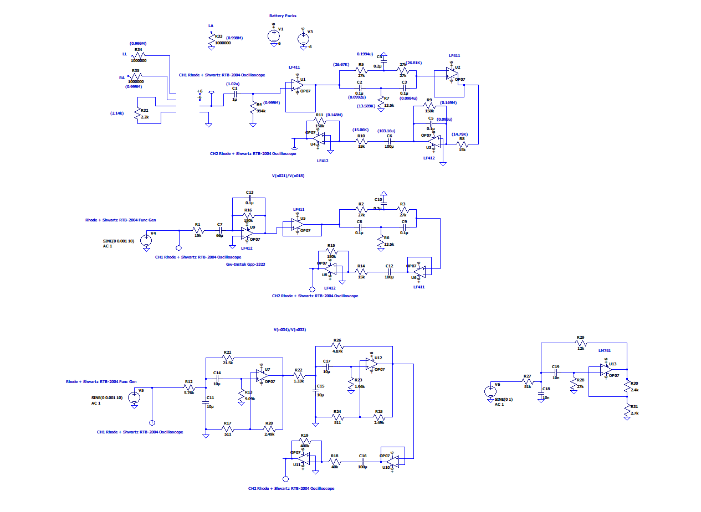
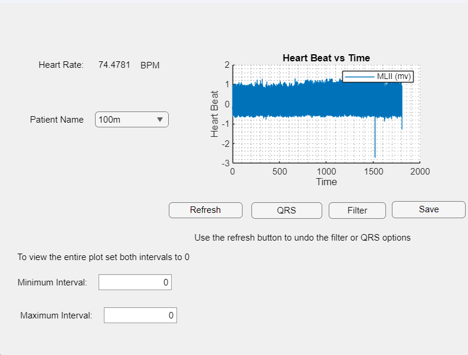
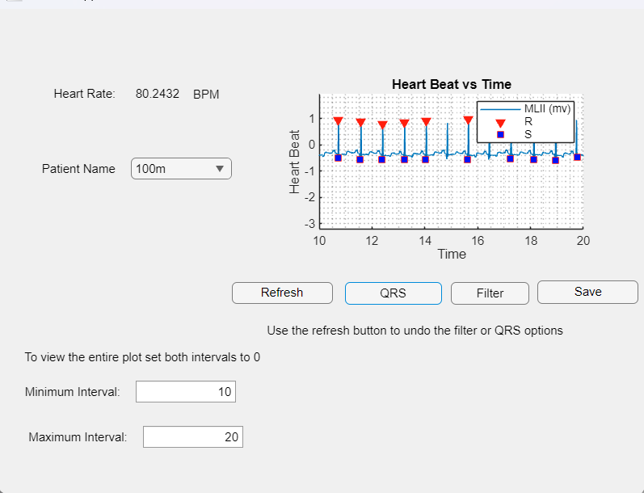

# ECG_GUI – MATLAB-Based ECG Signal Analyzer made for Applications of Embedded Spring 2023

This MATLAB GUI application processes ECG signals to detect QRS complexes and calculate heart rate in real time. It is designed to work with data acquired from an ECG circuit or from saved signal files. The tool offers a simple interface for biomedical signal analysis and visualization.

---

## Features

- **Real-Time ECG Plotting:** Visualizes the ECG waveform dynamically.
- **QRS Complex Detection:** Identifies R-peaks using signal processing techniques.
- **Heart Rate Calculation:** Computes beats per minute (BPM) based on detected QRS intervals.
- **Interactive GUI:** Easy-to-use interface with buttons to start/stop analysis and load signals.

---

## Requirements

- MATLAB (R2021a or newer recommended)
- Signal Processing Toolbox (for filtering and analysis)
- ECG signal (from a data file)

---

## How to Use

1. **Launch the GUI**:  
   Open MATLAB, navigate to the `MIT-BIH-Arrhythmia-Database_GUI or ECGGUI` folder, and run:
   ```matlab
   Part1.mlapp or ECG_GUI.mlapp

 ## GUI
*ECG Circuit*  


*GUI Layout*  


*Graph After Filtered and smaller interval*  


